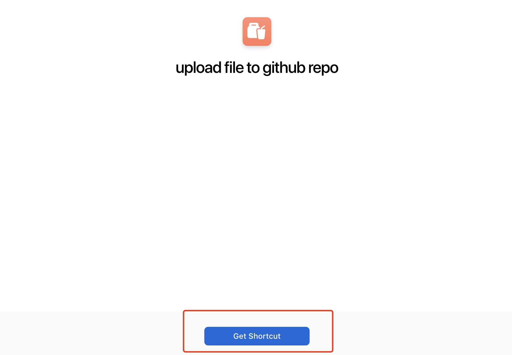

# 一键上传图片到github仓库

## 实现原理

利用mac系统提供快捷指令，调用tinypng压缩api来实现图片压缩，然后通过github api来实现传到github仓库。

将github仓库图片部署到vercel来实现cdn加速，这样就有一个简单的图床网站。

## 前提条件
- 注册一个tinypng网站获取api key

    [tinypng注册](https://tinypng.com/developers)

- github账号设置token

  [设置token ](https://github.com/settings/tokens)

## 快捷指令下载
下载地址：https://www.icloud.com/shortcuts/fc54a4e3320740dfab777c0c0f21f2d7

### 安装如下图：

 
#### 安装成功后就进入快捷指令app中，找到导入成功的`upload file to github repo`

### 配置指令信息

- 图片中1位置对应https://tinypng.com网站提供的api key。

- 图片中2位置对应github仓库相关信息配置

### 快捷指令使用
- 打开一个网页，找到需要下载的图片地址，选择“复制图片地址”

- 运行快捷指令 

- 输入重命名的文件名，并点击”确认“

- 这个时候指令开始执行起来，如果成功后，会有一个提示“提示图片已经上传成功“

## 使用过程中如有问题，可以直接提issue